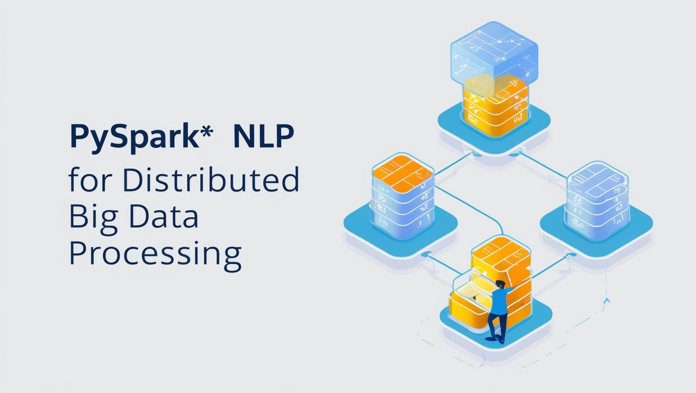

# Entailed/Contradiction classification on DocNLI dataset using PySpark

Natural Language Processing (NLP) bridges the gap between human language and computer systems, enabling machines to analyze, interpret, and generate human-like text. It is extensively applied in tasks such as language translation, sentiment analysis, text summarization, pattern identification, and predictive modeling.

However, the sheer volume of data handled in real-world NLP applications often surpasses the processing capacity of traditional CPUs and GPUs running on standalone machines. This limitation necessitates the use of distributed computing systems, which offer scalability and efficiency for handling large-scale data.

PySpark, a versatile library built on Apache Spark, facilitates distributed data processing and provides robust support for implementing NLP tasks. By leveraging PySpark, computationally intensive NLP operations can be performed seamlessly across clusters, ensuring faster processing and higher scalability.

This project harnesses the capabilities of PySpark to perform classification predictions on the DocNLI dataset, a benchmark for document-level natural language inference. By utilizing PySpark's distributed environment, the project demonstrates efficient handling of large datasets and showcases the integration of NLP techniques with big data processing.

# Data Source

[DocNLI: A Large-scale Dataset for Document-level Natural Language Inference](https://arxiv.org/abs/2106.09449)

# Important Link

[PySpark code for classification](./NLP_Week10_Assignment04_DocNLI_Entailed_Contradiction_Prediction.ipynb)
